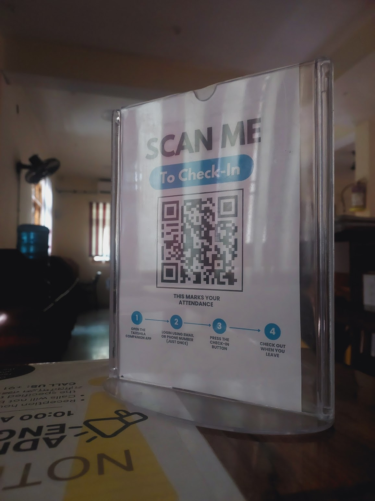
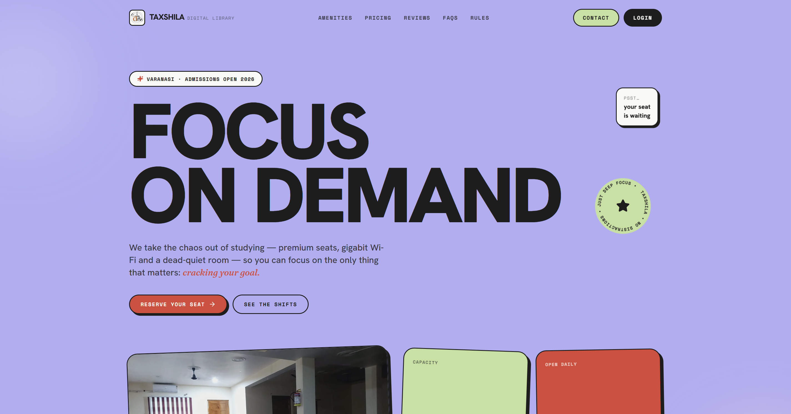
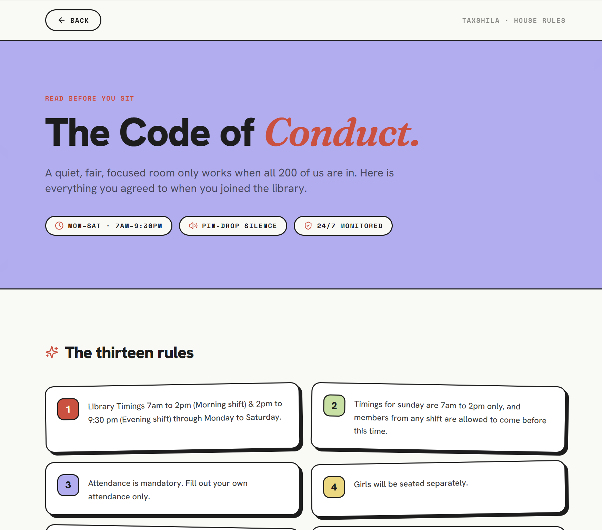
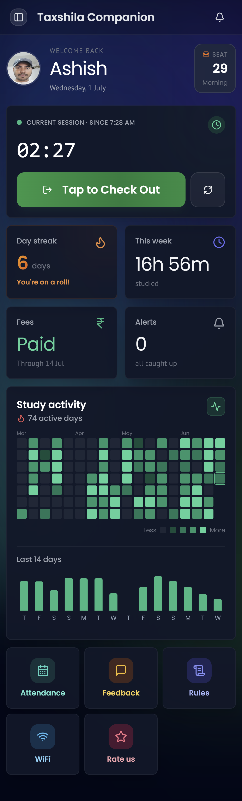
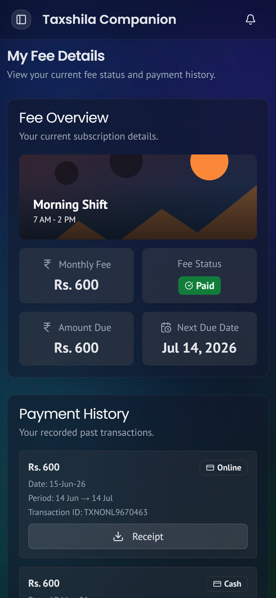
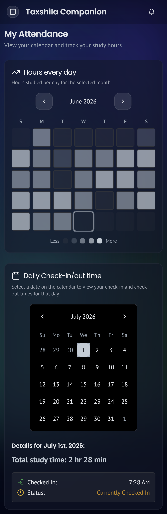
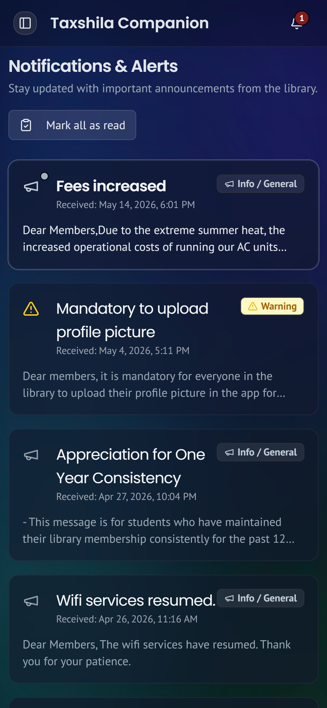
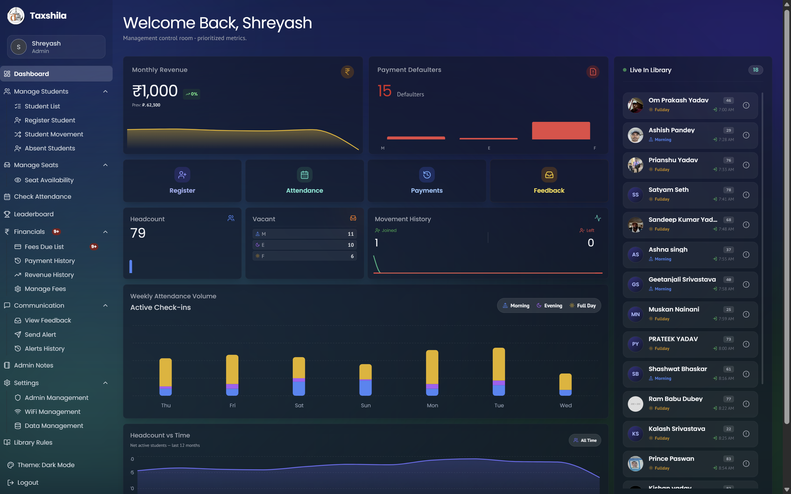
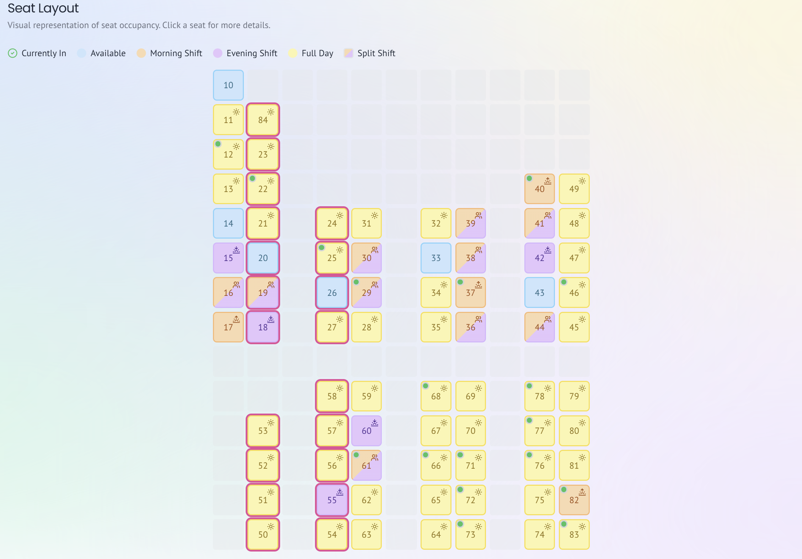

<div align="center">

<h1>Taxshila Companion</h1>

<p><strong>The operating system for a real, running study library.</strong><br />
One QR code at the front desk turns attendance, study streaks, seats, fees, and push alerts into a single loop, on the web and on Android, from one codebase.</p>

<p>
  
  
  
  
  
  
</p>

</div>

---

## 📊 By the numbers

This isn't a demo. It runs a real library, in production, every day.

<div align="center">

| | | |
|:---:|:---:|:---:|
| **100K+** | **100+** | **1** |
| database reads & writes<br/>served per day | active members<br/>checking in daily | developer, designed,<br/>built & shipped end-to-end |
| **Web + Android** | **~25K** | **8** |
| one codebase,<br/>two platforms | lines of TypeScript<br/>across 144 files | domain services<br/>behind a clean API |

</div>

> Built solo, from the database schema to the pixel, auth, data layer, real-time dashboards, push infrastructure, QR pipeline, the Android wrapper, and the marketing landing page.

---

## 💡 The one idea behind it

There is a **single printed QR code** taped to the reception desk. A member opens the app, taps **"Scan to check in,"** points the camera, and they are marked present, a short buzz confirms it. Checking out is one tap. That is the whole loop, and everything else exists to make that loop honest and keep people coming back tomorrow.

<div align="center">
  
  <br />
  <sub>The whole system starts here, one stand on the front desk.</sub>
</div>

The scanner reads the code with the phone's built-in `BarcodeDetector` when it exists and **falls back to a hand-tuned `jsQR` decoder** on a cropped, downscaled frame otherwise. That fallback is the difference between "works" and "works instantly" on cheap phones and inside an Android WebView.

---

## 🎨 The public face

A new person from Google Maps/JustDial meets a landing page built to *sell the room*, a bold **"Focus on Demand"** hero, amenities, pricing, reviews and FAQs, in a punchy editorial style that looks nothing like a templated dashboard. Every pixel here is mine too.

<div align="center">
  
</div>

And a **house-rules page**, "The Code of Conduct", that turns thirteen library rules into something people actually read: quiet-hours and monitoring badges up top, then plain-spoken, color-coded cards.

<div align="center">
  
</div>

---

## 👤 What members get

A member lives on **one screen**: a live session timer the moment they check in, their current day streak, hours logged this week, fee status, and their seat.

- 🟩 **A GitHub-style contribution grid** of study activity, paired with a two-week bar chart.
- 🔥 **Streak cards that earn attention**, the color warms and the wording changes the longer the run gets, because a bare number never made anyone come back.
- 📅 **Attendance calendar** and a **fees & history** view (payment happens at the desk; the app just tells you exactly where you stand).
- ⚙️ **Profile controls**, seat/shift change requests and a one-tap notifications switch, plus an alerts inbox.

<div align="center">
  
  &nbsp;&nbsp;
  
  &nbsp;&nbsp;
  
  &nbsp;&nbsp;
  
</div>

## 🛠️ What admins get

The admin side is built for someone standing at a desk being asked questions all day.

- 📈 **A dashboard that leads with the numbers that matter**, headcount, revenue, seats in use, recent joins and exits, with virtualized live lists that stay smooth at scale.
- 🏆 **A leaderboard** of top weekly hours and longest active streaks, so it's obvious who's grinding and who's about to break a good run. Tap anyone to open their profile.
- 👥 **Full student management**, register, edit, move between shifts and seats, and flag members who've gone quiet, with per-shift seat availability.
- 💸 **Fees**, dues, complete payment history, and revenue over time.
- 📣 **Communication**, broadcast or one-to-one alerts, and an inbox for the feedback that comes back.
- 📦 **One-click CSV import/export** of the whole dataset for backups and migrations.

<div align="center">
  <table>
    <tr>
      <td align="center"></td>
      <td align="center"></td>
    </tr>
    <tr>
      <td align="center"><sub>Dashboard, live at-a-glance numbers</sub></td>
      <td align="center"><sub>Student management</sub></td>
    </tr>
  </table>
</div>

---

## 🏗️ Under the hood

The parts you'd care about.

**Two push channels, picked automatically.** Inside the Android app, notifications run through **OneSignal** (native registration on first launch). On the web, they run through **Firebase Cloud Messaging**. The app detects which surface it's on and routes fee reminders, attendance nudges, payment confirmations, and announcements down the right pipe.

**A real service layer, not scattered queries.** All data access lives behind eight domain services, students, attendance, fees, communication, notifications, so pages read like intent (`getMemberStudyStats(...)`) instead of raw Firestore calls. Shared aggregation helpers mean the dashboard and the attendance page compute streaks from a *single* source of truth.

**Role-based access, enforced on both sides.** `admin` and `member` roles, plus a read-only **reviewer guest** account. The rule lives in one place (`src/lib/auth-utils.ts`) and is enforced client-side *and* re-verified server-side (`src/lib/api-auth.ts`), the client is never trusted alone.

**Server-authoritative writes.** Sensitive mutations (creating auth users, deleting students, bulk import/export) go through Next.js **API routes backed by `firebase-admin`**, with the service account kept server-only. The browser gets React Query caching and optimistic UI; the server gets the final say.

**Built to stay fast as it grows.** `@tanstack/react-virtual` keeps long student and attendance lists at 60fps, React Query dedupes and caches reads, and Turbopack keeps the dev loop tight.

---

## ✨ Engineering highlights

- **Dual-platform from one Next.js codebase**, the same app is the website and, wrapped with Median, the Android app.
- **Resilient QR pipeline**, native `BarcodeDetector` with a downscaled `jsQR` fallback, tuned for low-end hardware.
- **Type-safe end to end**, TypeScript in `strict` mode with builds that *fail* on type or lint errors (no `ignoreBuildErrors` escape hatch).
- **Validated everywhere**, `react-hook-form` + `zod` schemas guard every form and server boundary.
- **Tested where it counts**, Vitest suites cover the auth, export, and service logic that would hurt most if it broke.
- **CI-friendly hygiene**, Husky + lint-staged run ESLint on every commit.

---

## 🧰 Tech stack

| Layer | Choices |
|---|---|
| **Framework** | Next.js 15 (App Router), React 19, TypeScript |
| **Backend & data** | Firebase, Firestore, Auth, Cloud Functions, `firebase-admin` on the server |
| **UI** | Tailwind CSS, Radix UI primitives, Recharts, Lucide |
| **State & forms** | TanStack Query, TanStack Virtual, react-hook-form, zod |
| **Push** | OneSignal (Android native) + Firebase Cloud Messaging (web) |
| **Scanning** | Browser `BarcodeDetector` + `jsQR` fallback |
| **AI** | Genkit with Google AI |
| **Mobile** | Median Android wrapper |
| **Tooling** | Vitest, ESLint, Husky, lint-staged, Turbopack |

---

## 🚀 Running it locally

You need **Node 18.18+** and a Firebase project.

```bash
git clone https://github.com/ItsMat78/Taxshila-Companion.git
cd Taxshila-Companion
npm install
```

Add a `.env` in the project root:

```bash
# Client (public)
NEXT_PUBLIC_FIREBASE_API_KEY=
NEXT_PUBLIC_FIREBASE_AUTH_DOMAIN=
NEXT_PUBLIC_FIREBASE_PROJECT_ID=
NEXT_PUBLIC_FIREBASE_MESSAGING_SENDER_ID=
NEXT_PUBLIC_FIREBASE_APP_ID=
NEXT_PUBLIC_FIREBASE_MEASUREMENT_ID=
NEXT_PUBLIC_FIREBASE_VAPID_KEY=

# Server (service account, keep secret)
FIREBASE_PROJECT_ID=
FIREBASE_CLIENT_EMAIL=
FIREBASE_PRIVATE_KEY=
```

```bash
npm run dev      # dev server on http://localhost:9002
```

| Command | Does |
|---|---|
| `npm run build` / `npm run start` | production build & serve |
| `npm run lint` | lint |
| `npm run typecheck` | type-check (`tsc --noEmit`) |
| `npm test` | Vitest suite |

---

## 📁 Project layout

```
src/
├── app/           # App Router routes, /member, /admin, /api, public pages
├── components/    # shared + feature UI
├── services/      # data access: students, attendance, fees, notifications
├── lib/           # Firebase init, auth rules, push helpers, utilities
└── config/nav.ts  # role-filtered sidebar
functions/         # Firebase Cloud Functions
```

---

<div align="center">

Designed, built, and shipped by **[Shreyash Rai](mailto:shreyashrai078@gmail.com)**.

<sub>Questions, feedback, or just want to say hi → shreyashrai078@gmail.com</sub>

</div>
